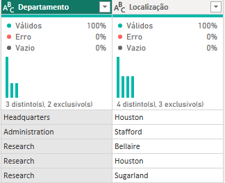

# Transformação de dados com Power BI

Transformação de dados utilizando Power BI que foram carregador de um banco de dados MySQL na Azure.

## Passos feitos

- Criei o bando de dados MySQL no Azure.
- Criei as tabelas no MySQL.
- Carreguei os dados no banco de dados do MySQL.
- Puxei os dados do MySQL no Azure para o Power BI.
- Mudei os tipos de dados dos SSN para número inteiro.
- Modifiquei os valores monetários para o tipo double preciso.
- Dividi o endereço no "employee" para colunas separadas com "Street Name", "Street Number", "City" e "State".
- Mesclei employee e departament criando uma tabela employee com o nome dos departamentos associados aos colaboradores.
- Removi as colunas desnecessárias.
- Mesclei os nomes dos gerentes aos seus respectivos colaboradores pelo Power BI.
- Mesclei as colunas de Nome e Sobrenome dos colaboradores e gerentes.
- Mesclei os nomes de departamentos com a localização.
(A mescla é necessária porque ela cria um relacionamento entre tabelas usando uma coluna compartilhada, unindo dados relevantes. Por outro lado, a operação 'Atribuir' criaria uma tabela onde os dados não teriam relação significativa, o que não atenderia ao propósito pretendido.)
- Agrupei os dados com os colaboradores por gerente.
- Removi colunas desnecessárias.

## Imagens

